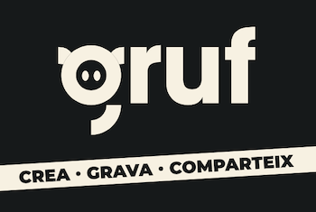
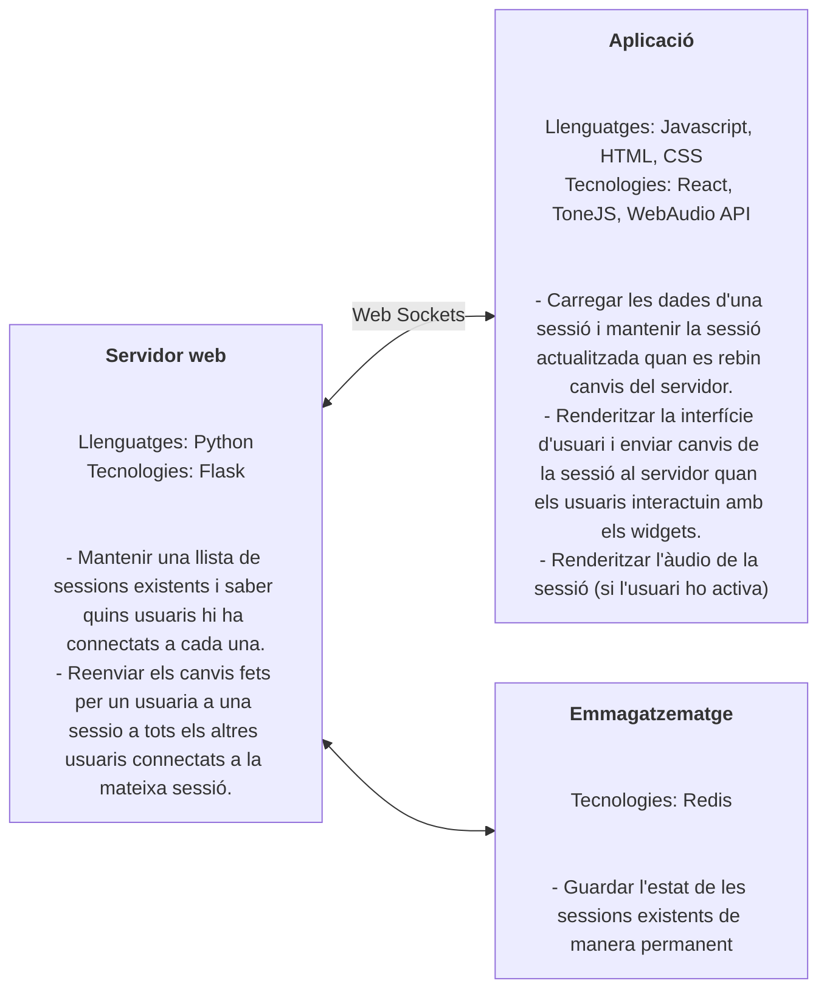
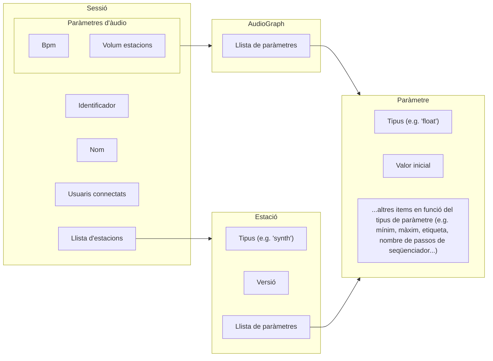
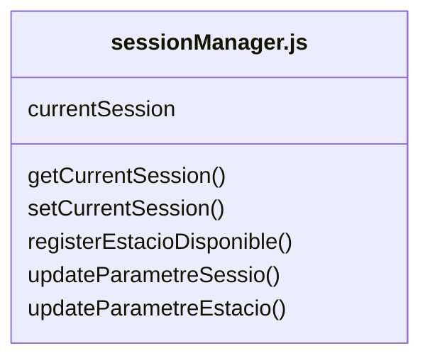
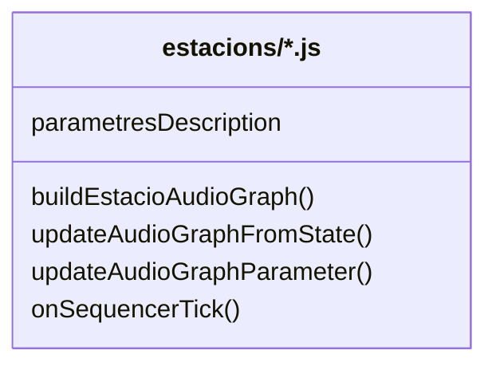
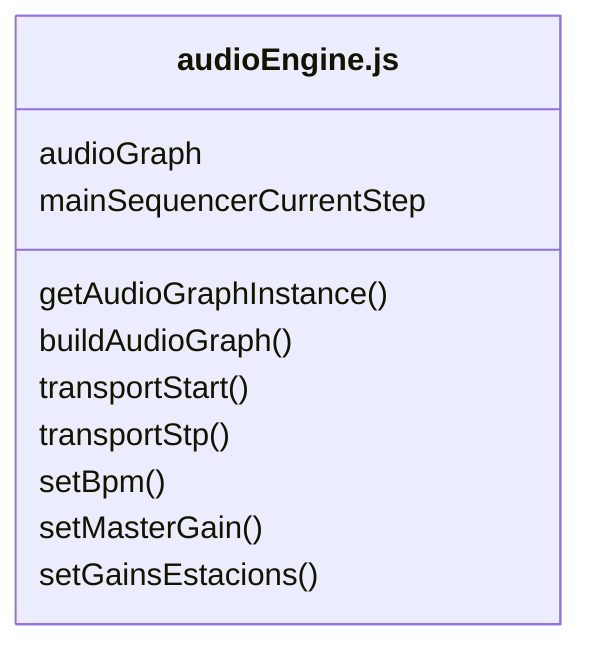
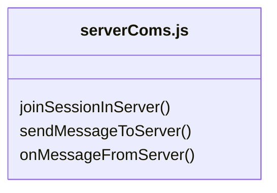

<p align="center">
  
</p>

## Instruccions d'instal·lació

Necessites que [Docker](https://www.docker.com/products/docker-desktop/) estigui funcionant al teu ordinador. Suposant que està instal·lat i en execució, segueix aquestes instruccions:

1. Clona i fes `cd` al repositori

```shell
git clone git@github.com:versembrant/GRUF.git
cd versembrant-gruf/
```

2. Construeix les imatges de Docker:

```shell
docker compose build
```

3. Construeix la biblioteca de mostres: els fitxers d'àudio per al sampler i el groovebox s'han de copiar a la carpeta `static/audio`, dins de les subcarpetes corresponents `/sampler` i `/groovebox`, i després s'ha d'executar el següent script de Python per crear el fitxer `sampleLibrary.js (tingues en compte que això s'ha d'executar una vegada, encara que sigui només per crear una biblioteca de sons buida). Els fitxers d'àudio es poden descarregar aquí: https://drive.google.com/file/d/1evpcD3svnlILLIfc8wSDF1PQrzoufyrb/view?usp=share_link

```shell
docker compose run --rm server python make_sample_library.py
```

4. Instal·la les dependències estàtiques i construeix els estàtics:

```shell
docker compose run --rm server yarn install
docker compose run --rm server yarn build
```

5. Executa l'aplicació (això també inclou un observador de compilació estàtica perquè els fitxers estàtics es tornin a construir automàticament quan es modifiqui el codi font):

```shell
docker compose up
```

6. Accedeix a l'aplicació amb el navegador a: `http://localhost:5555/`


## Diagrames

### Diagrama de blocs general



### Diagrama de blocs del model de dades



### Diagrama de l'aplicació
#### sessionManager.js
Gestió de la sessió carregada.


#### estacions/*.js
- Codi per definir les diferents estacions disponibles, amb els paràmetres de cada estació i el codi per renderitzar l'àudio que far servir l'audio engine.
- Per afegir un nou tipus d'estació, cal crear un arxiu en aquesta carpeta seguint els que hi ha d'exemple, i cal importa-rlo a index.js i cridar el mètode "registerEstacioDisponible".


#### pagines/*.js
- Codi específic per a cada una de les pàgines de l'aplicació.
- La pàgina més important és la de "sessio.js", que és bàsicamnt la pàgina que es fa servir per participar en una sessió.
- Una altra pàgina és la de "novaWessio.js", que es fa servir per crear una sessió nova i que els usuaris s'hi puguin connectar després.


#### components/*.jsx
- Interfície d'usuari per les diferents parts de l'aplicació.

#### audioEngine.js
- S'encarrega de renderitzar l'àudio. Per a cada sessió, se suposa que només hi haurà un àudio graph funcionant d'un dels usuaris connectats (per exemple, el mestre), però cada usuari pot activar el seu àudio graph i el so es renderitzarà al seu dispositiu també (pot ser útil, per exemple, quan dos usuaris col·laboren en remot)
- Tots els audio graphs que estàn funcionant a la vegada estàn sincronitzats "més o menys" seguint a un d'ells que serà el "master audio engine".



#### serverComs.js
Comunicació bidireccional amb el servidor.



#### server.py
Implementa el servidor.
- Mètodes per replicar missatges rebuts d'un usuari d'una sessió a tots els altres usuaris connectas a la sessió.
- Mètodes per guardar sessions i mantenir-ne una llista de les disponibles.

## Debug

Es poden utlizar alguns paràmetres opcionals a la URL per poder testejar temes relacionats amb performance:

* `minimalui=1`: no renderitza la UI principal, només el títol de la sessió i el botó de play.
* `interativelatency=1`: optimiza el contexe the tone js per interactivity (pot tenir pitjor performance però fa servir un lookAhead menor).
* `audio=1`: connecta l'àudio per defecte, sense preguntar-ho a l'usuario.