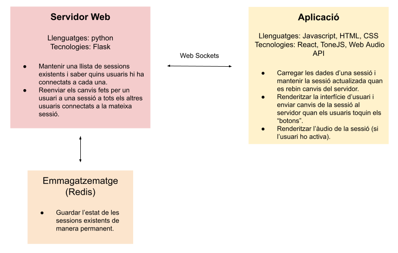
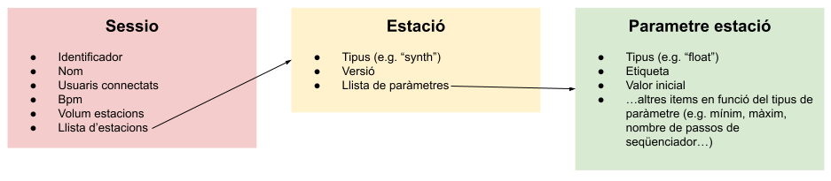
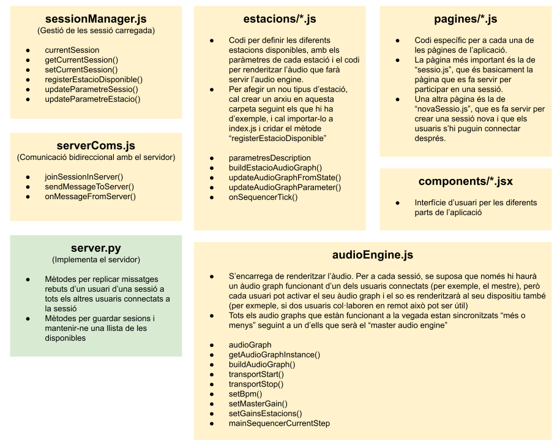

# versembrant-bruixit

## Installation instructions

You need [Docker](https://www.docker.com/products/docker-desktop/) to be insalled in your machine. Assuming it is installed, follow these instructions:

1) Clone and `cd` to repo
```
git clone git@github.com:ffont/versembrant-bruixit.git
cd versembrant-bruixit/
```

2) Build Docker images:
```
docker compose build
```

3) Install static dependencies and build static:
```
docker compose run --rm server yarn install
docker compose run --rm server yarn build
```

4) Run server (this also inclues a static build watcher so that static files will be automatically rebuilt when modifying files):
```
docker compose up
```

5) Open running application by poiting the browser at `http://localhost:5555/bruixit/`


## Diagrames

### Diagrama de blocs general




### Diagrama de blocs del model de dades




### Diagrama de l'aplicació




## Instruccions de desplegament en el servidor (swhosting)

Hi ha un script de python/fabric que s'encarrega d'agafar la última versio de codi de la branca `main`, actualizar el codi del servidor, fer un build dels arxius static, i fer un restart del `docker compose`. Només s'ha de córrer aquesta comanda:

```
# NOTA: això afectarà al servidor remot, no ho feu si no ho hem acordat abans :)
docker compose run --rm server fab deploy
```

OJU!: aquest repositori ja inclou les claus ssh necessàries per poder accedir al servidor remot, no el compartiu!

Podeu accedir a l'aplicació corrent al servidor remot aquí: http://cl2024011711001.dnssw.net/bruixit/


## Instruccions de desplegament mode TEST en el servidor (swhosting)

Per a poder fer proves en el servidor remot sense afectar el desplegament principal de l'aplicació, es pot fer servir el flag `--test` al córrer l'script de deploy. Això desplegarà l'aplicació a http://cl2024011711001.dnssw.net/bruixit-test/ (en comptes de http://cl2024011711001.dnssw.net/bruixit/). Opcionalment també es pot especificar el branch que es vol desplegar amb el flag `--branch xxx`. Per exemple:

```
docker compose run --rm server fab deploy --test --branch proves_1234
```

Si no s'especifica cap branch, es desplegarà el branch `main`.


### SSL

Per fer funcionar HTTPS fem servir certificats de letsencrypt. Aquí hi ha instruccions: https://www.nginx.com/blog/using-free-ssltls-certificates-from-lets-encrypt-with-nginx/
Bàsicament `certboot` de letsencrypt modifica la configuració de Nginx, així que si actualitzem la configuació hauriem d'actualitzar també amb `certbot`. La primera instal·lació de certificats es fa amb aquesta comanda:

```
sudo certbot --nginx -d
```

Després es pot renovar amb un `cronjob` automaticament (veure instruccions del link) o amb la comanda:

```
certbot renew --quiet
```